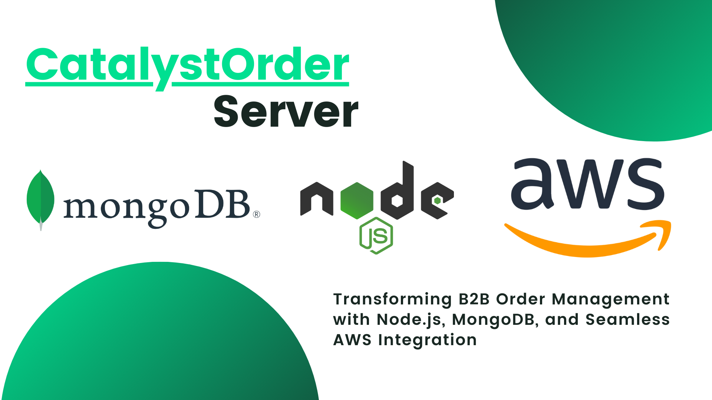

# B2B Ordering Management App

{width=100%}

The B2B Ordering Management App is a robust platform built using Node.js, MongoDB, and AWS services to facilitate streamlined business-to-business order management. This app empowers both suppliers and retail sellers, providing them with a seamless experience for product listing, ordering, and tracking.

## Features

- **Authentication System**: The app features a secure authentication system that enables users to sign up as retail sellers of a supplier.

- **Supplier Management**:
  - Suppliers can easily add their products to the app, complete with photos, detailed descriptions, pricing, categories, and other essential information.
  - The app offers a user-friendly interface for suppliers to manage their product listings efficiently.

- **Efficient Order Handling**:
  - Suppliers receive orders directly through the app, containing all the necessary details. They can conveniently track their orders to streamline their fulfillment process.
  - Retail sellers can place orders seamlessly, providing a hassle-free experience.

- **Intuitive User Interface**:
  - The app boasts a professional and visually appealing interface, enhancing the user experience for both suppliers and retail sellers.
  - Retail sellers can effortlessly browse products, create wishlists, and place orders.

- **Backend Architecture**:
  - The app's backend is built using Node.js, which offers a scalable and efficient foundation for handling user interactions and data management.
  - MongoDB is utilized as the database system, ensuring reliable storage and retrieval of user and product data.

- **AWS Integration**:
  - To handle large files such as product photos, the app integrates with an AWS S3 bucket, providing efficient and reliable storage for multimedia content.

## How It Works

The B2B Ordering Management App utilizes a combination of Node.js, MongoDB, and AWS services to create a seamless experience for suppliers and retail sellers. Here's an overview of the app's functionality:

1. **Authentication**: Users can sign up and log in, accessing their respective roles as suppliers or retail sellers.

2. **Supplier Experience**:
   - Suppliers can easily add their products, complete with detailed information and photos.
   - They can efficiently manage their product listings and track incoming orders.

3. **Retail Seller Experience**:
   - Retail sellers can explore the product catalog, add items to their wishlist, and effortlessly place orders.
   - The app provides a user-friendly ordering process for retail sellers.

4. **Backend Logic**:
   - Node.js powers the backend, managing user authentication, product listing, order handling, and communication between suppliers and retail sellers.

5. **Data Storage**:
   - MongoDB is employed as the database system, ensuring reliable storage and retrieval of user profiles, product details, and order information.

6. **AWS Integration**:
   - The app seamlessly integrates with an AWS S3 bucket to store and manage large files, such as product photos.

## Getting Started

To set up and run the B2B Ordering Management App locally, follow these steps:

1. Clone this repository to your local machine.

2. Install the required dependencies using `npm install`.

3. Configure the MongoDB connection in the appropriate configuration file.

4. Set up your AWS S3 credentials for file storage.

5. Run the app using `npm start`.

6. Access the app through your web browser at `http://localhost:3000`.
## Examples:
Here are a few examples of other projects I have worked on:

**Affine Cifer Crypto:** https://github.com/ba-beker/Affine_Cifer_Crypto

**Push Swap :** https://github.com/ba-beker/push_swap

**so_long:** https://github.com/ba-beker/so_long

Feel free to explore these projects to get a better understanding of my range of skills and coding style.

If you have any questions or would like to discuss this project further, please feel free to contact me. Thank you for taking the time to review my work!